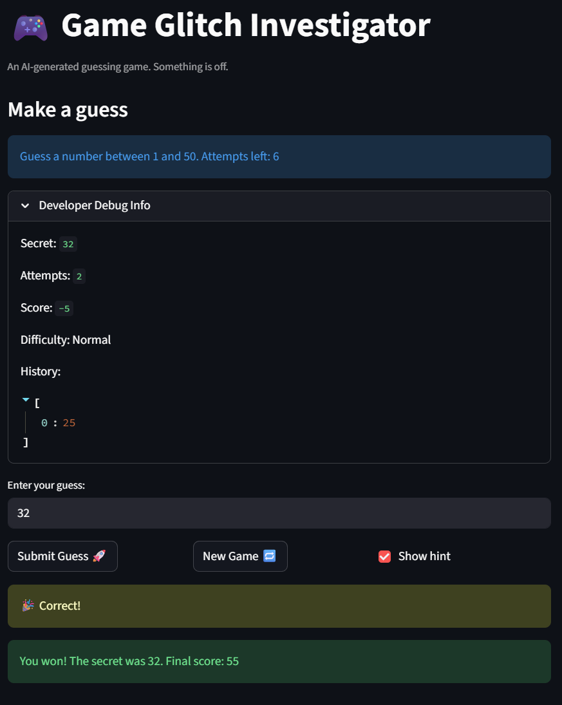

# 🎮 Game Glitch Investigator: The Impossible Guesser

## 🚨 The Situation

You asked an AI to build a simple "Number Guessing Game" using Streamlit.
It wrote the code, ran away, and now the game is unplayable. 

- You can't win.
- The hints lie to you.
- The secret number seems to have commitment issues.

## 🛠️ Setup

1. Install dependencies: `pip install -r requirements.txt`
2. Run the broken app: `python -m streamlit run app.py`

## 🕵️‍♂️ Your Mission

1. **Play the game.** Open the "Developer Debug Info" tab in the app to see the secret number. Try to win.
2. **Find the State Bug.** Why does the secret number change every time you click "Submit"? Ask ChatGPT: *"How do I keep a variable from resetting in Streamlit when I click a button?"*
3. **Fix the Logic.** The hints ("Higher/Lower") are wrong. Fix them.
4. **Refactor & Test.** - Move the logic into `logic_utils.py`.
   - Run `pytest` in your terminal.
   - Keep fixing until all tests pass!

## 📝 Document Your Experience

- [ ] Describe the game's purpose.
The purpose of the game is for people to guess a secret number based off of hints given if the guess is wrong. It allows people to apply binary search/divide and conquer methods to find the secret number.
- [ ] Detail which bugs you found.
- [ ] Explain what fixes you applied.
1. The hint is incorrect. They are switched around. So I changed the sign and switched the high and low texts.
2. Clicking on New Game just changes the secret number. It doesn't clear the history. Even changing the difficulty does not clear the history. In other words, there is no way to start a new game other than restarting the app or refreshing the page. This is fixed by resetting the game state when starting a new game, generating a new secret number, and changing the status to "playing". Furthermore, by using session states, the secret number doesn't change with every refresh.
3. The difficulty and the range of numbers do not match. Easy says that it has a range of 1 to 20, yet the game said to guess a number between 1 and 100. Normal is said to have a range of 1 to 100 while hard has a range of 1 to 50, which doesn't make sense. The range for normal and hard were since swapped.

## 📸 Demo

- [ ] [Insert a screenshot of your fixed, winning game here]
      

## 🚀 Stretch Features

- [ ] [If you choose to complete Challenge 4, insert a screenshot of your Enhanced Game UI here]
